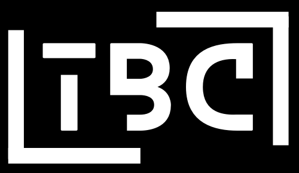

<a name="readme-top"></a>

<!-- PROJECT SHIELDS -->
<!--
*** The README I refered to make this was using  markdown "reference style" links for readability.
*** Reference links are enclosed in brackets [ ] instead of parentheses ( ).
*** See the bottom of this document for the declaration of the reference variables
*** for contributors-url, forks-url, etc. This is an optional, concise syntax you may use.
*** https://www.markdownguide.org/basic-syntax/#reference-style-links
-->
[![Contributors][contributors-shield]][contributors-url]
[![Forks][forks-shield]][forks-url]
[![Stargazers][stars-shield]][stars-url]
[![Issues][issues-shield]][issues-url]
[![MIT License][license-shield]][license-url]
[![LinkedIn][linkedin-shield]][linkedin-url]


<!-- PROJECT LOGO -->
<br />
<div align="center">
  <a href=""https://github.com/trushant05/tiny_board_chronicles>
    
  </a>

  <h3 align="center">Tiny Board Chronicles</h3>

  <p align="center">
    <br />
    <a href="https://github.com/trushant05/tiny_board_chronicles"><strong>Explore the docs »</strong></a>
    <br />
    <br />
    <a href="https://github.com/trushant05/tiny_board_chronicles">View Demo</a>
    ·
    <a href="https://github.com/trushant05/tiny_board_chronicles/issues">Report Bug</a>
    ·
    <a href="/https://github.com/trushant05/tiny_board_chronicles/issues">Request Feature</a>
  </p>
</div>


<!-- TABLE OF CONTENTS -->
<details>
  <summary>Table of Contents</summary>
  <ol>
    <li>
      <a href="#about-the-project">About The Project</a>
      <ul>
        <li><a href="#built-with">Built With</a></li>
      </ul>
    </li>
    <li>
      <a href="#getting-started">Getting Started</a>
      <ul>
        <li><a href="#prerequisites">Prerequisites</a></li>
        <li><a href="#installation">Installation</a></li>
      </ul>
    </li>
    <li><a href="#usage">Usage</a></li>
    <li><a href="#roadmap">Roadmap</a></li>
    <li><a href="#contributing">Contributing</a></li>
    <li><a href="#license">License</a></li>
    <li><a href="#contact">Contact</a></li>
    <li><a href="#acknowledgments">Acknowledgments</a></li>
  </ol>
</details>


<!-- ABOUT THE PROJECT -->
## About The Project

[![Product Name Screen Shot][product-screenshot]](https://example.com)

<p align="justify"> A space for exploring, experimenting with, and sharing insights on various single board computers (SBCs) like Jetson, Raspberry Pi, and more. Dive into detailed guides, project ideas, and technical deep dives to unlock the full potential of these compact computing powerhouses.</p>

<p align="right">(<a href="#readme-top">back to top</a>)</p>


### Built With

<p align="justify">
This documentation is made with <a href="https://squidfunk.github.io/mkdocs-material/">Material for MKDocs</a> which is a powerful documentation framework on top of <a href="https://www.mkdocs.org/">MKdocs</a>, a static site generator for project documentation.</p>


<p align="right">(<a href="#readme-top">back to top</a>)</p>


<!-- GETTING STARTED -->
## Getting Started

To get a local copy up and running follow these simple example steps.

### Prerequisites

This is an example of how to list things you need to use the software and how to install them.
* Considering you are either on Linux/MacOS and have Python 3 already installed with pip:
  ```sh
  python --version
  pip --version
  ```

### Installation

_Next step would be to install mkdocs-material, you could do this either system wide or use virtual environment like venv, conda, etc._

1. Install mkdocs-material with pip:
   ```sh
   pip install mkdocs-material
   ```
2. Run mkdocs locally:
   ```sh
   mkdocs server
   ```

Note: Make sure that your current working directory contains mkdocs.yml file.

<p align="right">(<a href="#readme-top">back to top</a>)</p>


<!-- USAGE EXAMPLES -->
## Usage

If you would like to add new sections, you could add them to nav section in mkdocs.yml file and make a corresponding md file in the docs directory. If this is the first time you are working with Material for MKDocs, please refere to this [Documentation](https://squidfunk.github.io/mkdocs-material/)

<p align="right">(<a href="#readme-top">back to top</a>)</p>


<!-- ROADMAP -->
## Roadmap

- [x] Base Template for the Tiny Board Chronicles Site
- [ ] Add Jetson Orin Nano Installation Guide
- [ ] Add Jetson Orin Nano Docker Guide
- [ ] Add Jetson Orin Nano Accessories Guide

See the [open issues](https://github.com/trushant05/tiny_board_chronicles/issues) for a full list of proposed features (and known issues).

<p align="right">(<a href="#readme-top">back to top</a>)</p>


<!-- CONTRIBUTING -->
## Contributing

Contributions are what make the open source community such an amazing place to learn, inspire, and create. Any contributions you make are **greatly appreciated**.

If you have a suggestion that would make this better, please fork the repo and create a pull request. You can also simply open an issue with the tag "enhancement".
Don't forget to give the project a star! Thanks again!

1. Fork the Project
2. Create your Feature Branch (`git checkout -b feature/AmazingFeature`)
3. Complete base setup
4. Commit your Changes (`git commit -m 'Add some AmazingFeature'`)
5. Push to the Branch (`git push origin feature/AmazingFeature`)
6. Open a Pull Request

Note: Make sure to exlude unnecessary files like your virtual environments while commiting your branch.

<p align="right">(<a href="#readme-top">back to top</a>)</p>


<!-- LICENSE -->
## License

Distributed under the MIT License. See `LICENSE.txt` for more information.

<p align="right">(<a href="#readme-top">back to top</a>)</p>


<!-- CONTACT -->
## Contact

Your Name - [@your_twitter](https://twitter.com/your_username) - email@example.com

Project Link: [https://github.com/your_username/repo_name](https://github.com/your_username/repo_name)

<p align="right">(<a href="#readme-top">back to top</a>)</p>


<!-- ACKNOWLEDGMENTS -->
## Acknowledgments

Use this space to list resources you find helpful and would like to give credit to. I've included a few of my favorites to kick things off!

* [Choose an Open Source License](https://choosealicense.com)
* [GitHub Emoji Cheat Sheet](https://www.webpagefx.com/tools/emoji-cheat-sheet)
* [Malven's Flexbox Cheatsheet](https://flexbox.malven.co/)
* [Malven's Grid Cheatsheet](https://grid.malven.co/)
* [Img Shields](https://shields.io)
* [GitHub Pages](https://pages.github.com)
* [Font Awesome](https://fontawesome.com)
* [React Icons](https://react-icons.github.io/react-icons/search)

<p align="right">(<a href="#readme-top">back to top</a>)</p>

<!-- MARKDOWN LINKS & IMAGES -->
<!-- https://www.markdownguide.org/basic-syntax/#reference-style-links -->
[contributors-shield]: https://img.shields.io/github/contributors/trushant05/tiny_board_chronicles.svg?style=for-the-badge
[contributors-url]: https://github.com/trushant05/tiny_board_chronicles/graphs/contributors
[forks-shield]: https://img.shields.io/github/forks/trushant05/tiny_board_chronicles.svg?style=for-the-badge
[forks-url]: https://github.com/trushant05/tiny_board_chronicles/forks
[stars-shield]: https://img.shields.io/github/stars/trushant05/tiny_board_chronicles.svg?style=for-the-badge
[stars-url]: https://github.com/trushant05/tiny_board_chronicles/stargazers
[issues-shield]: https://img.shields.io/github/issues/trushant05/tiny_board_chronicles.svg?style=for-the-badge
[issues-url]: https://github.com/trushant05/tiny_board_chronicles/issues
[license-shield]: https://img.shields.io/github/license/trushant05/tiny_board_chronicles.svg?style=for-the-badge
[license-url]: https://github.com/trushant05/tiny_board_chronicles/blob/main/LICENSE.txt
[linkedin-shield]: https://img.shields.io/badge/-LinkedIn-black.svg?style=for-the-badge&logo=linkedin&colorB=555
[linkedin-url]: https://linkedin.com/in/trushant-adeshara/
[product-screenshot]: docs/assets/img/sbcs.png

[C-badge]: https://img.shields.io/badge/C-white?style=flat
[C-url]: https://www.learn-c.org/
[Cpp-badge]: https://img.shields.io/badge/C%2B%2B-white?style=flat&logo=cpp
[Cpp-url]: https://cplusplus.com/
[Python-badge]: https://img.shields.io/badge/Python-white?style=flat&logo=python
[Python-url]: https://www.python.org/
[Matlab-badge]: https://img.shields.io/badge/MATLAB-white?style=flat&logo=MATLAB
[Matlab-url]: https://www.mathworks.com/products/matlab.html
[Js-badge]: https://img.shields.io/badge/Javascript-black?style=flat&logo=javascript
[Js-url]: https://developer.mozilla.org/en-US/docs/Web/JavaScript
[Rust-badge]: https://img.shields.io/badge/Rust-black?style=flat&logo=rust
[Rust-url]: https://www.rust-lang.org/

## Reference
This README.md file was inspired from work of [othneildrew](https://github.com/othneildrew/Best-README-Template).
