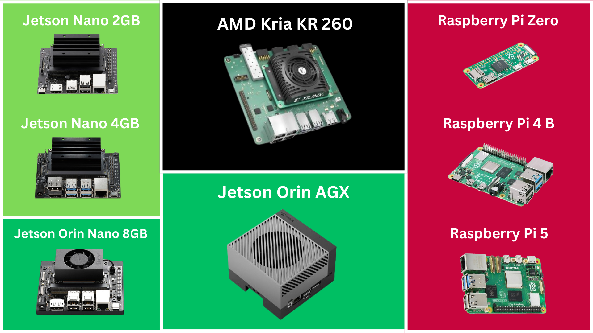

# Tiny Board Chronicles

## Welcome to Tiny Board Chronicles 

In a world increasingly driven by technology, single board computers (SBCs) and edge computing have become pivotal in shaping the future of AI and robotics. Tiny Board Chronicles is your ultimate hub for everything related to SBCs, focusing on the Jetson ecosystem, Raspberry Pi ecosystem, and AMD Kria ecosystem. Whether you're a hobbyist, a developer, or a tech enthusiast, this site is designed to provide you with comprehensive setup guides, step-by-step tutorials, and links to all the exciting projects I have built using these powerful devices.

## Why Single Board Computers and Edge Computing?

Single board computers are revolutionizing the way we approach computing and development for several reasons:

<ol>
<li> <b>Affordability</b>: SBCs offer powerful computing capabilities at a fraction of the cost of traditional computers.</li>
<li><b>Compactness</b>: Their small form factor makes them ideal for integration into various applications, from home automation to advanced robotics.</li>
<li> <b>Energy Efficiency</b>: SBCs consume less power, making them suitable for projects requiring long-term deployments without significant energy costs.</li>
<li> <b>Versatility</b>: From AI inference at the edge to real-time data processing, SBCs can handle a wide range of tasks with ease.</li>
<li> <b>Community and Support</b>: A large, vibrant community means abundant resources, forums, and libraries to help you overcome any challenge.</li>

## The Future of AI and Robotics with SBCs

As we move towards a more connected and intelligent world, the role of SBCs in AI and robotics is becoming ever more critical:

<ul>
<li><b>Edge Computing</b>: Bringing computation and data storage closer to the sources of data, edge computing reduces latency and bandwidth use, enabling faster decision-making and real-time processing.</li>
<li><b>AI Integration</b>: With SBCs like the NVIDIA Jetson series, running complex AI models and neural networks at the edge is now possible, empowering autonomous systems and smart devices.</li>
<li><b>Robotics</b>: SBCs provide the brains behind modern robotics, from simple hobbyist projects to advanced industrial robots, driving innovation in automation and intelligent systems.</li>
</ul>

With Tiny Board Chronicles, my aim is to provide you go-to resource for unlocking the full potential of these incredible devices. Join me as we explore the endless possibilites of edge computing, and embark on exciting projects that push the boudnaries of what these tiny boards can achieve.
